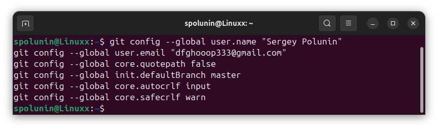
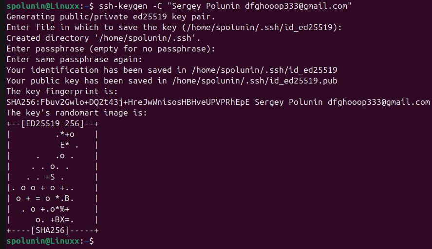
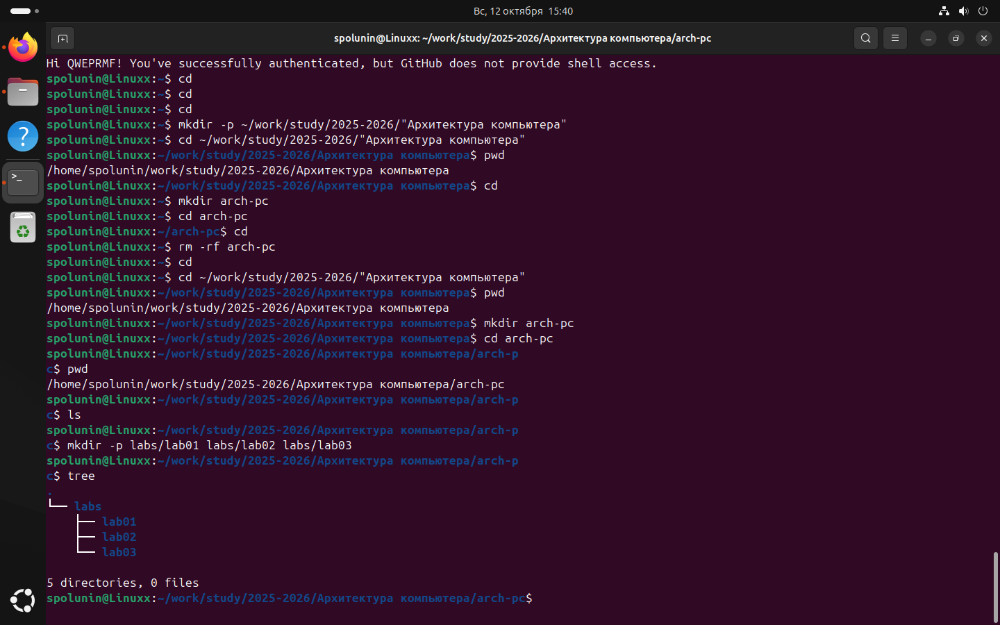
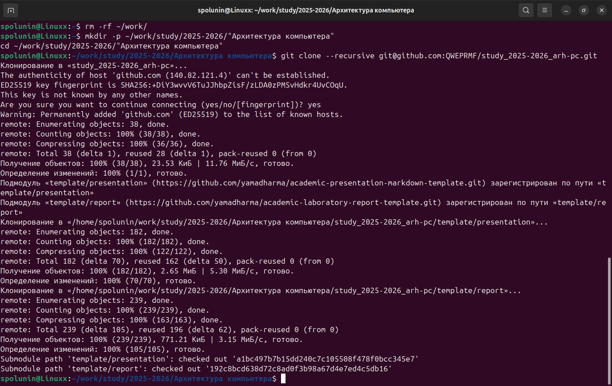
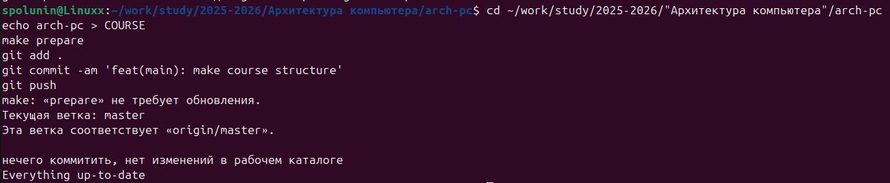
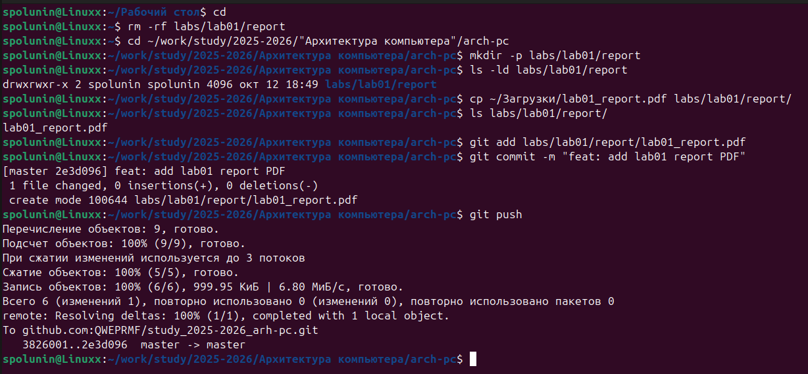

# Лабораторная работа №2 
Студент: Полунин Сергей Иванович 
Группа: НБИ-02-25 

## Цель работы
Целью работы является изучение идеологии и применения средств
контроля версий, приобретение практических навыков по работе с системой контроля версий git.

## Выполнение лабораторной работы

2.4.2. Базовая настройка git

Сначала сделаю предварительную конфигурацию git. Открою терминал и введу следующие команды, указав имя и e-mail владельца репозитория (Рис. 1)

Настраиваю utf-8 в выводе сообщений git (Рис. 1)

Зададаю имя начальной ветки (будем называть её master) (Рис. 1)

Параметр autocrlf (Рис. 1)

Параметр safecrlf (Рис. 1)

2.4.3. Создание SSH-ключа

Генерирую пару ключей (приватный и открытый) (Рис. 2)

Далее необходимо загрузить сгенерированный открытый ключ. Для этого
захожу на сайт http://github.org/ под своей учётной записью и перехожу в меню Setting. После этого выбираю в боковом меню SSH and GPG keys и нажимаю кнопку New SSH key. Копирую из локальной консоли ключ в буфер обмена. Вставляю ключ в появившееся на сайте поле и указываю для ключа имя
(Title) 

2.4.4. Создание рабочего пространства и репозитория курса на основе
шаблона
Открываю терминал и создаю каталог для предмета «Архитектура компьютера» и структуру каталогов (Рис. 3)

2.4.5. Создание репозитория курса на основе шаблона

Перехожу на станицу репозитория с шаблоном курса
https://github.com/yamadharma/course-directory-student-template.Далее выберию Use this template. В открывшемся окне задаю имя репозитория (Repository name) study_2025–2026_arh-pcи создаю репозиторий (кнопка Create repository from template). Открываю терминал и перехожу в каталог курса и клонирую сосланный репозиторий (Рис. 4)

2.4.6. Настройка каталога курса

Перехожу в каталог курса (Рис. 5)

Создаю необходимые каталоги (Рис. 5)

Отправляю файлы на сервер (Рис. 5)

Проверяю правильность создания иерархии рабочего пространства в локальном репозитории и на странице github (Рис. 5)

2.5. Задание для самостоятельной работы

1. Создаю отчет по выполнению лабораторной работы в соответствующем каталоге рабочего пространства (labs/lab02/report) (Рис. 6).

2. Скопирую отчеты по выполнению предыдущих лабораторных работ в соответ ствующие каталоги созданного рабочего пространства (Рис. 6).

3. Загружу файлы на github (Рис. 6).

Отчет не идеальный,так как половину скриншотов были давно удалены 

