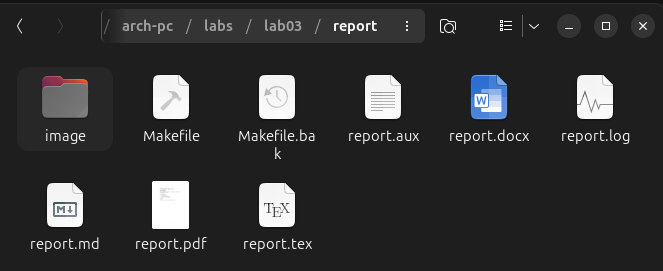
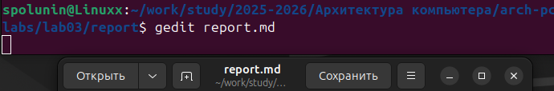
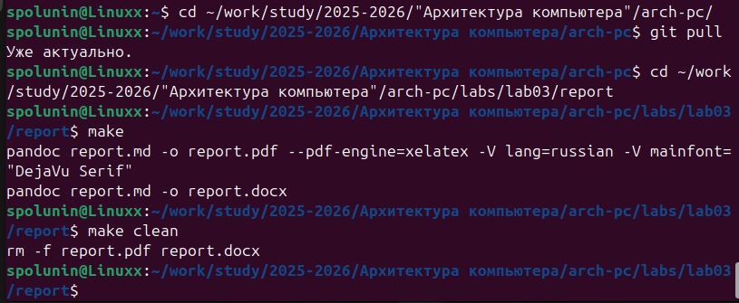

# Лабораторная работа №3  
Студент: Полунин Сергей Иванович 
Группа: НБИ-02-25 

## Цель работы
Целью работы является освоение процедуры оформления отчетов с помощью легковесного языка разметки Markdown.

##Выполнение лабораторной работы 

3.4 Порядок выполнения лабораторной работы

1. Открываю терминал
 
2. Перехожу в каталог курса, сформированный при выполнении лабораторной работы № 2:

Обновляю локальный репозиторий, скачав изменения из удаленного репозитория с помощью команды

git pull

3. Перехожу в каталог с шаблоном отчета по лабораторной работе №3

4. Проверяю компиляцию шаблона с использованием Makefile. Для этого введу команду

make

При успешной компиляции должны сгенерироваться файлы report.pdf и report.docx.

5. Удаляю полученныe файлы с использованием Makefile. Для этого ввожу команду

make clean

Проверяю, что после этой команды файлы report.pdf и report.docx были удалены.

6. Открываю файл report.md c помощью любого текстового редактора, например gedit

Внимательно изучаю структуру этого файла.

7. Ваполняю отчет и компилирую отчет с использованием Makefile. Проверяю корректность полученных файлов. (Обращаю внимание, для корректного отображения скриншотовони должны быть размещены в каталоге image.)

8. Загружаю файлы на Github.

3.5 Задание для самостоятельной работы 

1. В соответствующем каталоге сделал отчёт по лабораторной работе № 2 в формате
Markdown. В качестве отчёта предоставил отчёты в трех форматах: pdf,docx и md.

2. Загрузил файлы на github.

## Вывод 
Освоили процедуры оформления отчетов с помощью легковесного зыка разметки Markdown.
